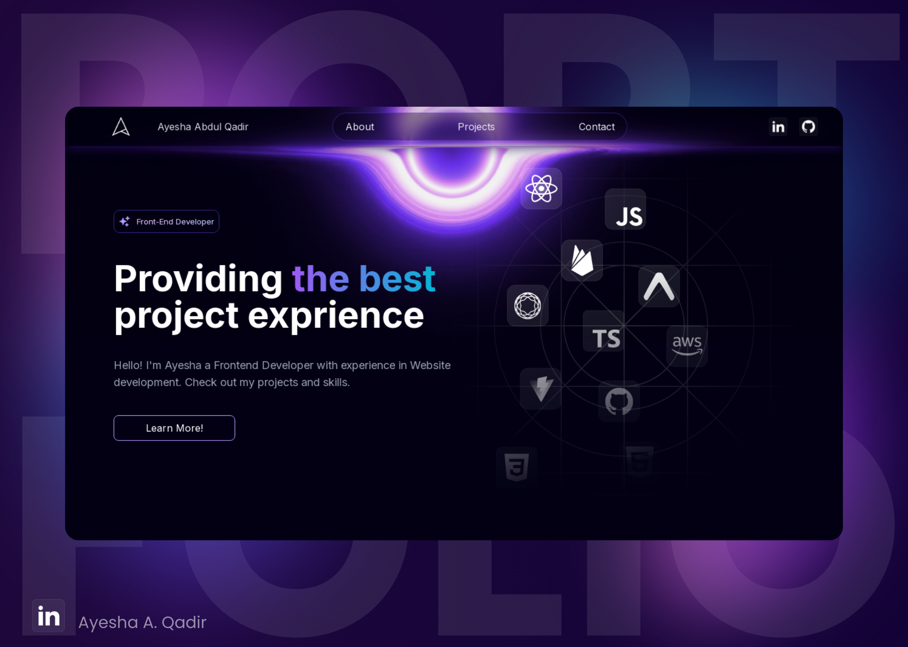

# My Portfolio

Welcome to my portfolio! This project showcases my skills, experience, and projects as a web developer.



**[Live Portfolio](https://ayeshaabdulqadir.vercel.app/)**

## 🚀 About Me

I’m Ayesha, a passionate web developer with a growing knowledge of cloud applied AI engineering. My journey in tech has been all about combining creativity and technology to build solutions that make an impact.


##  Technologies Used

- **Next.js** - For building fast and scalable web applications with server-side rendering (SSR).
- **Tailwind CSS** - For utility-first styling to create a custom, responsive design.
- **ShadCN** - For UI components that ensure a modern, cohesive look and feel.
- **Vercel** - For deployment and hosting.

##  Features

- **Responsive Design** - Fully responsive layout for a seamless experience across all devices.
- **Interactive UI** - Dynamic components and animations powered by Next.js and ShadCN.
- **Modern Design** - Clean, minimalist design built with Tailwind CSS.

##  How to Use

1. Clone this repository:
   ```bash
   git clone https://github.com/AyeshaQadir7/My_Portfolio.git
2. Install the dependencies:
   ```bash
   npm install
3. Run the development server:
   ```bash
   npm run dev
4. Open your browser and navigate to http://localhost:3000 to view portfolio.

## 📬 Contact Me

Feel free to reach out if you have any questions, feedback, or collaboration ideas. You can find me on [LinkedIn](https://www.linkedin.com/in/ayesha-a-qadir-30a0a72b9/) or email me directly at ayeshaabdulqadir07@gmail.com .

 
